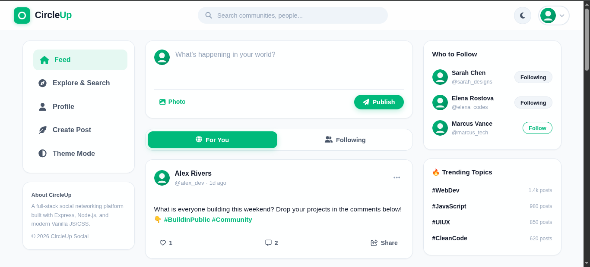
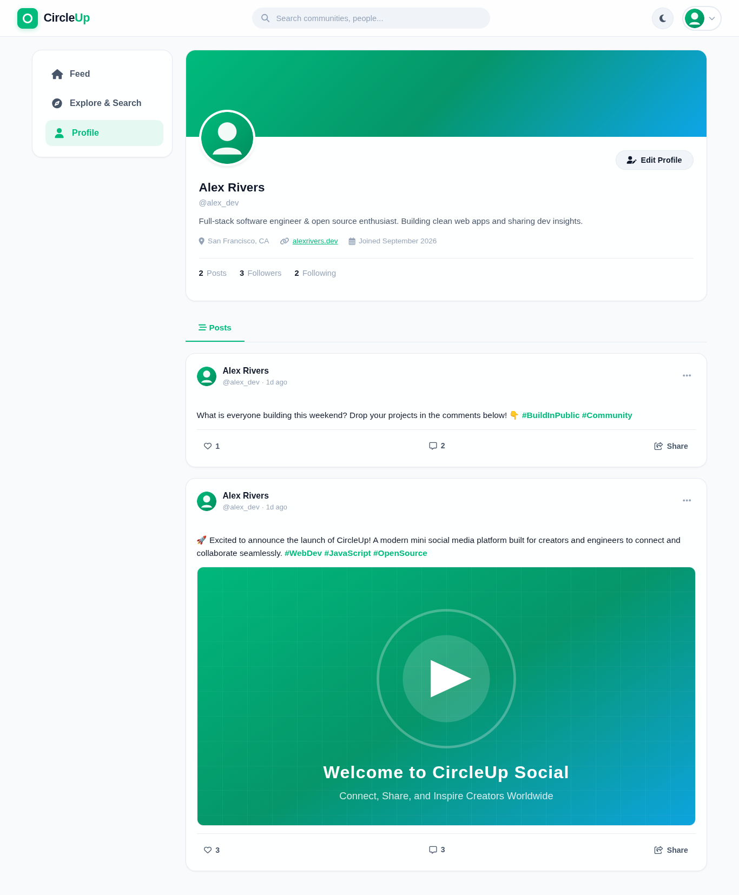
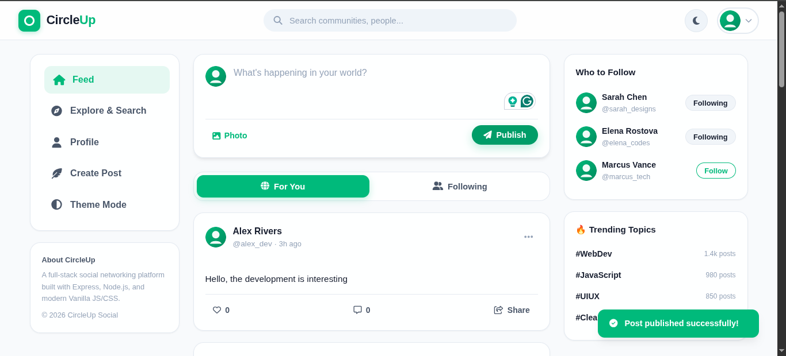
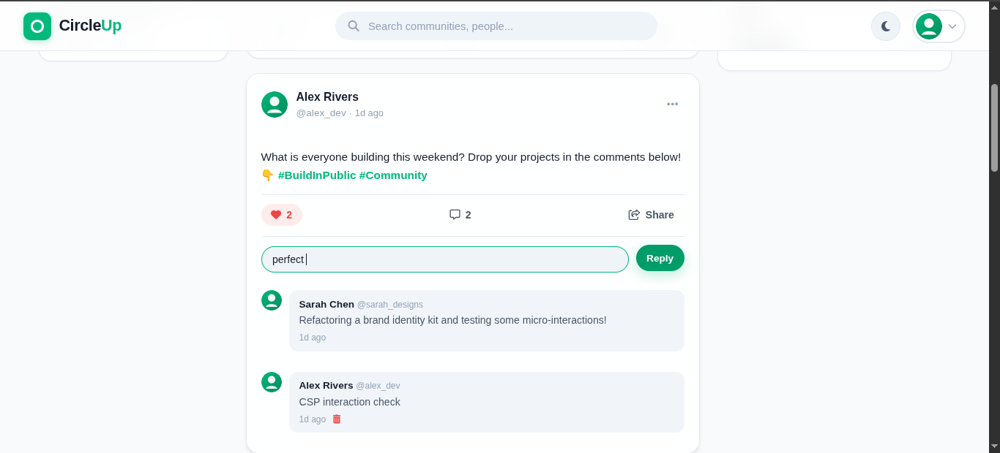
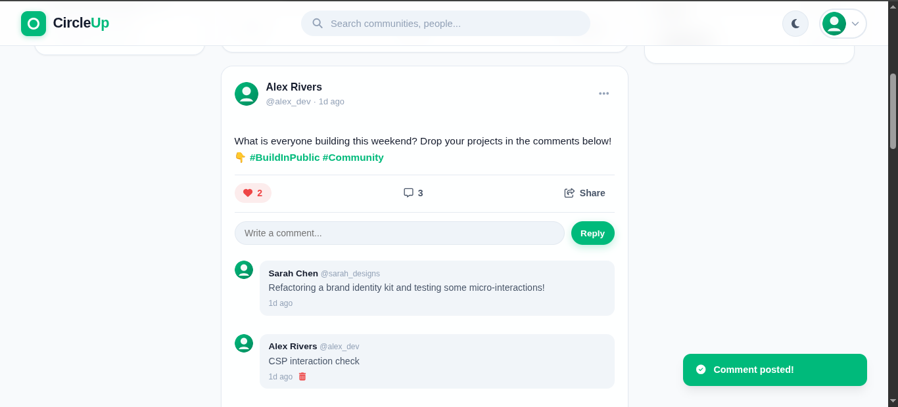
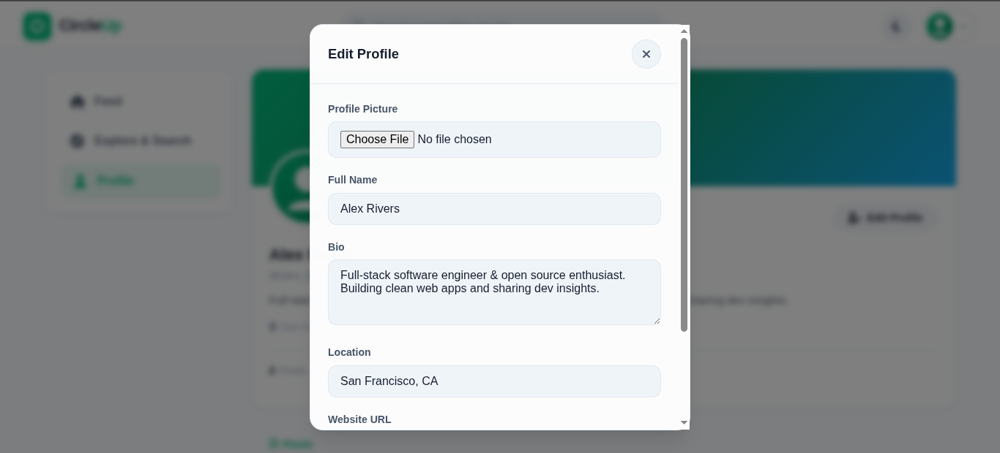
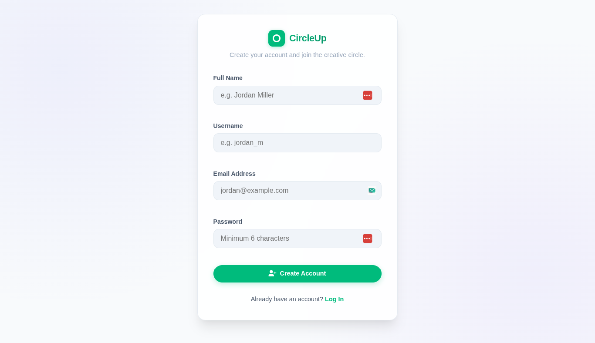
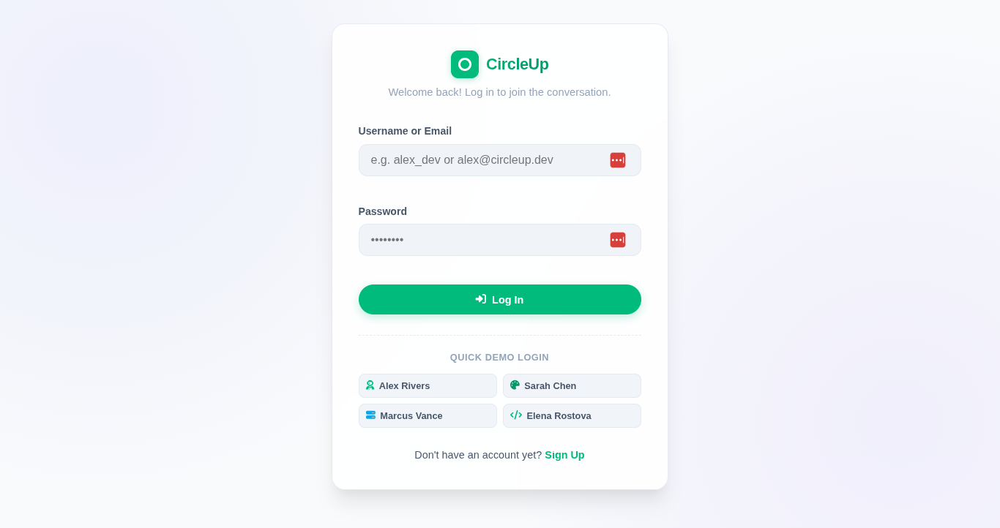

# CircleUp — Public Demo & Project Showcase

> A full-stack social media platform demonstrating authentication, user profiles, posts, image uploads, comments, likes, follow relationships, REST API design, relational data modeling, and automated API testing.

**Project type:** Learning project  
**Source code:** Maintained privately  
**Public repository purpose:** Demonstration, screenshots, architecture, and technical documentation
**Live URL:** https://circleup-4siz.onrender.com

---

## 📸 Project Preview

### Home Feed



CircleUp provides a social feed where users can discover posts and interact with content.

### User Profile



Profiles expose user information, social relationships, and published content.

### Social Feed & Post Interaction



Users can interact with posts through likes and comments while navigating their social feed.

### Comments



Posts support threaded-style discussion through user comments.

### Post Interaction



The interface provides feedback for social interactions and content engagement.

### Profile Editing



Users can update profile information and manage their profile presentation.

### Registration



New users can create an account through the registration flow.

### Login



Returning users authenticate through the login flow.

---

## ✨ Overview

CircleUp was developed as a practical full-stack web application to demonstrate how a social networking platform can be designed and implemented from the client interface through the REST API and relational database layer.

The application focuses on core social-media workflows:

- Account registration and authentication
- User profiles and avatars
- User search
- Follow and unfollow relationships
- Global and user-specific feeds
- Post creation, editing, and deletion
- Image uploads
- Likes and like counters
- Comments and comment management
- Hashtag highlighting
- URL detection
- Responsive interface design
- Light and dark themes
- Automated API testing

The project is primarily intended for local development and portfolio demonstration. It is **not presented as production-ready software** without additional security and deployment hardening.

---

## 🛠️ Technology Stack

| Area | Technologies |
| --- | --- |
| Frontend | HTML5, CSS3, Vanilla JavaScript (ES6+), Fetch API |
| Backend | Node.js, Express.js |
| Database | SQLite, `better-sqlite3` |
| Authentication | JWT, `bcryptjs` |
| File Uploads | Multer |
| Security | Helmet, CORS, Express Rate Limit, request validation |
| Testing | Jest, Supertest |
| Development | Nodemon, npm, Git |

---

## 🏗️ High-Level Architecture

```text
┌─────────────────────────────────────┐
│              Frontend               │
│ HTML5 · CSS3 · Vanilla JavaScript   │
└──────────────────┬──────────────────┘
                   │
                   │ Fetch API / REST
                   ▼
┌─────────────────────────────────────┐
│          Express.js Backend          │
│                                     │
│ Routes → Middleware → Controllers   │
└──────────────────┬──────────────────┘
                   │
          ┌────────┴─────────┐
          ▼                  ▼
┌──────────────────┐  ┌─────────────────┐
│ SQLite Database  │  │ Local Uploads   │
│ better-sqlite3   │  │ Multer          │
└──────────────────┘  └─────────────────┘
```

The backend follows an MVC-style organization in which routes define API entry points, middleware handles cross-cutting concerns such as authentication and validation, and controllers contain application logic.

See [`docs/architecture.md`](docs/architecture.md) for more detail.

---

## 🔐 Authentication & Security

CircleUp includes several security-oriented implementation practices:

- Password hashing with `bcryptjs`
- JWT-based authentication
- Protected API routes
- Authorization checks for user-owned resources
- Request validation
- API rate limiting
- Security headers through Helmet
- Configurable CORS
- Controlled file-upload handling through Multer
- SQLite relational constraints
- Environment-based configuration
- `.env` excluded from source control

The project documentation deliberately distinguishes these development safeguards from production hardening.

For a public deployment, additional review would be required for areas such as HTTPS, secret management, JWT storage, upload restrictions, database backups, monitoring, reverse-proxy configuration, dependency maintenance, and production error handling.

---

## 📡 REST API

The backend exposes its functionality through a REST API under `/api`.

### Authentication

| Method | Endpoint | Purpose |
| --- | --- | --- |
| POST | `/api/auth/register` | Create an account |
| POST | `/api/auth/login` | Authenticate a user |
| GET | `/api/auth/me` | Get the current user |
| POST | `/api/auth/logout` | End the current session |

### Users & Profiles

| Method | Endpoint | Purpose |
| --- | --- | --- |
| GET | `/api/users` | Search users |
| GET | `/api/users/:id` | Get a user profile |
| PUT | `/api/users/profile` | Update profile information |
| POST | `/api/users/avatar` | Update profile avatar |
| GET | `/api/users/:id/followers` | Get followers |
| GET | `/api/users/:id/following` | Get following |
| POST | `/api/users/:id/follow` | Follow a user |
| DELETE | `/api/users/:id/follow` | Unfollow a user |

### Posts

| Method | Endpoint | Purpose |
| --- | --- | --- |
| GET | `/api/posts` | Retrieve posts |
| POST | `/api/posts` | Create a post |
| GET | `/api/posts/:id` | Get a specific post |
| PUT | `/api/posts/:id` | Update a post |
| DELETE | `/api/posts/:id` | Delete a post |

### Likes & Comments

| Method | Endpoint | Purpose |
| --- | --- | --- |
| POST | `/api/posts/:id/like` | Like a post |
| DELETE | `/api/posts/:id/like` | Unlike a post |
| POST | `/api/posts/:id/like/toggle` | Toggle like state |
| GET | `/api/posts/:id/comments` | Get post comments |
| POST | `/api/posts/:id/comments` | Add a comment |
| PUT | `/api/comments/:id` | Edit a comment |
| DELETE | `/api/comments/:id` | Delete a comment |

---

## 🗄️ Data Model

CircleUp uses a relational SQLite database for local development.

```text
User
 │
 ├── Profile
 │
 ├── Posts
 │    ├── Comments
 │    └── Likes
 │
 └── Follows
```

Core relationships include:

- A user has one profile.
- A user can create multiple posts.
- A post can have multiple comments.
- A post can receive multiple likes.
- Users can follow other users.
- Database constraints help maintain relationship integrity.

See [`docs/architecture.md`](docs/architecture.md).

---

## 🧪 Testing

The application includes automated API testing using:

- Jest
- Supertest

The test suite covers major workflows such as:

- User registration
- Authentication
- Authorization
- Post creation and management
- Comment operations
- Likes
- Follow relationships
- Duplicate relationship prevention
- Feed behavior

---

## 🌱 Demo Data

CircleUp includes dedicated development/demo seed functionality.

The original application provides:

```bash
npm run seed
npm run seed:demo
```

Demo data is intended for **local development and portfolio demonstrations only**. Demo credentials should never be reused for production systems.

---

## 📁 Public Showcase Scope

This repository intentionally does **not** contain the complete application source code.

The private source repository contains the implementation and development history. This public showcase focuses on:

- Product presentation
- Screenshots
- Feature documentation
- Architecture documentation
- API overview
- Security considerations
- Technical project goals
- Development notes

This approach allows the project to be publicly reviewed while keeping the complete source implementation private.

---

## 📚 Documentation

- [Project Overview](docs/overview.md)
- [Features](docs/features.md)
- [Architecture](docs/architecture.md)
- [Technical Details](docs/technical-details.md)

---

## 🎯 Engineering Goals

CircleUp was created to demonstrate practical experience with:

- Full-stack web application development
- RESTful API design
- MVC-style architecture
- Authentication and authorization
- Relational database design
- CRUD operations
- File uploads
- Client-server communication
- Responsive UI development
- Automated API testing
- Git-based development workflows
- Application security practices

---

## 🔮 Future Improvements

Potential future enhancements include:

- Real-time notifications
- Direct messaging
- Post bookmarking
- User mentions
- Hashtag pages
- Content reporting
- User blocking
- Advanced search
- Infinite scrolling
- Real-time updates
- Improved media storage
- Production database integration
- Automated CI/CD
- Containerized deployment
- Stronger production security hardening

---

## 👨‍💻 Author

**Ahmet Zahir Absi — Software Engineer**

- GitHub: <https://github.com/zabmw89>
- Portfolio: <https://devfolioahmed.vercel.app/>

---

## 📄 License

This public showcase is provided for portfolio and demonstration purposes. See [`LICENSE.md`](LICENSE.md).

---

⭐ If you find the project interesting, consider visiting the author's portfolio or GitHub profile to explore more projects.
